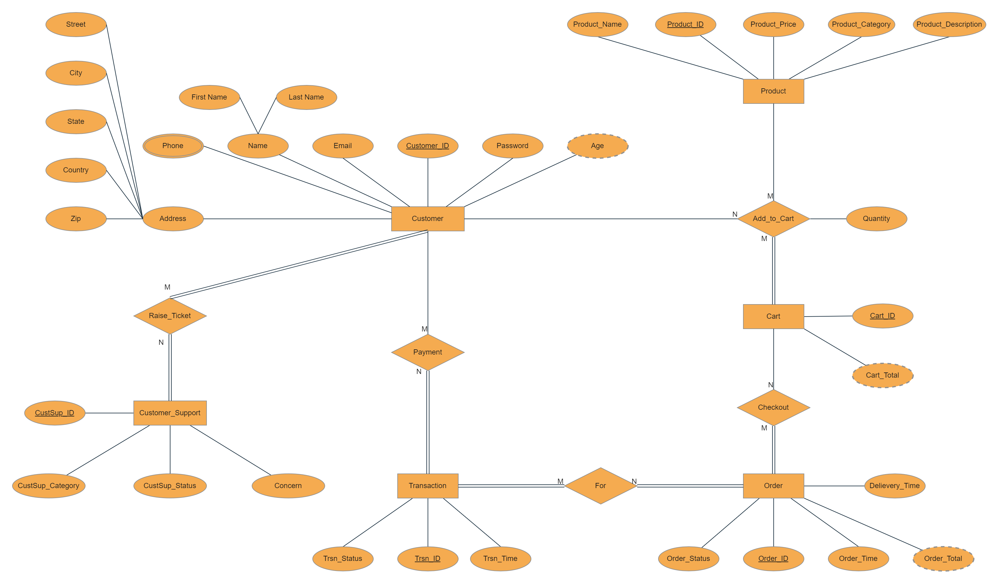
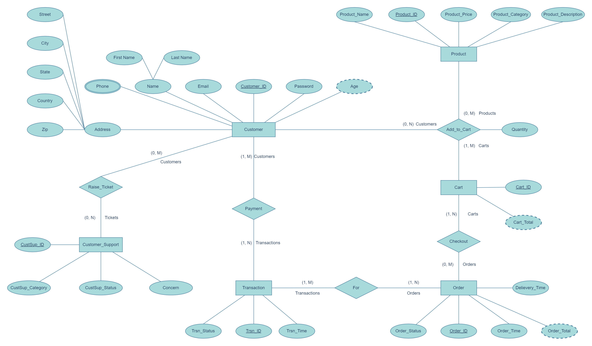

# Database Design Project for a Dermatology Products based E-commerce website (Company to Customer)
_Phase 1 project report for the CS631-011 Data Management System Design_

## Team Members
1. Venkata Sai Rahul Sunkari
2. Pranati Elena Burani
3. Abhinav Bachu
4. Snehardhi Devarapally

## Project Description

Our E-Commerce platform is designed to facilitate seamless interactions between customers and the company, offering a user-friendly interface for browsing products, making purchases, and engaging in customer support. The system incorporates key entities such as Customer, Product, Order, Transaction, Cart, and Customer Support to create a comprehensive and efficient online shopping experience.

Our database project's main goal is to create an effective E-commerce database by carrying out tasks such:
1. Reviewing and placing the orders
2. Preserving data uniformity between tables

## Conceptual ER Diagrams

### ER Diagram - Cardinality & Structural Constraints

 
### ER Diagram - (min, max) Notation

## Assumptions

- A customer can order and subsequently purchase the product only if it is added to a cart as depicted in the ER diagram.
- In the Raise_Ticket relationship we're ignoring the involvement of the employees of the company who'd offer the support.
- Passwords and other sensitive information if present is assumed to be stored securely based on standard industrial practices and not in scope of this project report.
- We've also ignored dynamic updates on the entities like available quantity, reviews (only after an order is fulfilled), etc.

## Constraints

| ENTITIES         | KEY INTEGRITY CONSTRAINT | UNIQUENESS CONSTRAINT | NOT NULL CONSTRAINT | DOMAIN CONSTRAINT |
| ---------------- | ------------------------ | --------------------- | ------------------- | ----------------- |
| CUSTOMER         | Customer_ID              | Email                 | First_Name          | Password          |
|                  |                          | Last_Name             | DateOfBirth         |
|                  |                          | Phone                 | Phone               |
|                  |                          | Address               |                     |
| PRODUCT          | Product_ID               | ProductName           | Product_Price       | Product_Price     |
| ORDER            | Order_ID                 |                       | Order_Total         | Order_Status      |
| TRANSACTION      | Trsn_ID                  |                       |                     | Trsn_Status       |
| CUSTOMER_SUPPORT | CustSup_ID               |                       | Concern             |                   |
| CART             | Cart_ID                  |                       |                     |                   |

## Challenges
- The quantity attribute was not initially intended to be mapped to the Add_to_Cart relationship, rather it was inclusive as part of the cart. Otherwise a new entity is required to capture all the items and their quantities and that entity should be related to the order entity.
- To separate the order entity from transaction entity - the rational behind this design is actually an assumption that a transaction might fail for a particular order due to eccentric reasons and the customer is expected to retry another transaction to successfully place the order leading to a M:N cardinal relationship.
- Restricting the scope of the project to focus on the key elements of the course over a generalized broader choice of project topic.

